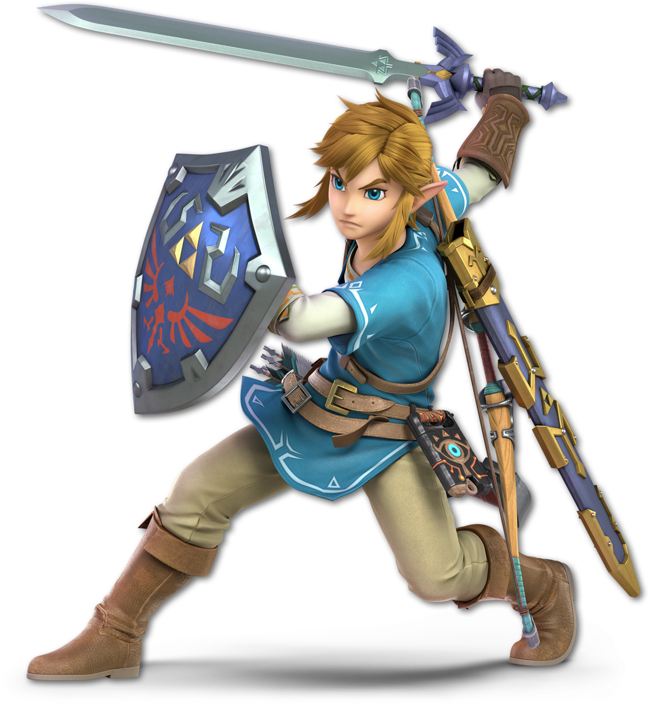

  

# Git - GitHub 

  

Créditos de la wiki:  [https://zelda.fandom.com/es/wiki/Link]("https://zelda.fandom.com/es/wiki/Link")

> **Comandos de git:** [Git Cheat Sheet]("https://zelda.fandom.com/wiki/Link")

Holas a todos y bienvenidos sean al curso de Git y GitHub. Saber git es vital para trabajar en la industria del software así que mucho ojo.

Como creo todavía no tienen experiencia en la parte de programación (algún valiente que acepte preguntas le damos un premio), haremos la creación de un wiki de Link de The Legend of Zelda.
### Evaluación 🤖✍🏻

| Criterio | Porcentaje|
|:--------:|:---------:|
| Proyecto |    70%    |
| Tarea    |    30%    |

### Equipos:

| Nombre   		      | Integrantes                    |
|:--------------------:|:------------------------------:|
|   |     |
|  	|     |
|  	|     |

### Líderes

- ** [MN]**: 
- ** [FS]**:
- ** [LMP]**:

### Convención de commits 👀

**TODOS** sus commits deben empezar de la forma: 

- Baderas disponibles: 
 - **FEATURE**: Ponerla cuando pongan pedazos nuevos al markdown
 - **FIX**: Ponerla cuando hagan corrección de algo que ya estaba

`[BANDERA][SECCION-DE-WIKI][INICIALES-DE-EQUIPO] Comentario`

**EN MAYÚSCULAS**

### Ejemplos: 

- Supongamos que el equipo de La Mafia del Poder quiere agregar un pedazo a la wiki en la sección de perfil, sus commits deben ir de la siguiente forma.

`git commit -m "[FEATURE][PERFIL][LMP] Añadí en perfil sobre la personalidad de Link"`

- Supongamos que el equipo de Movimiento Naranja quiere agregar un pedazo a la wiki en la sección de Habilidades, sus commits deben ir de la siguiente forma.

`git commit -m "[FEATURE][HABILIDADES][MN] Añadí la descripción de las habilidades de Link"`

- Supongamos que el equipo de Farmacias Similares quiere corregir algo de un commit pasado de la sección de Apariciones, no sé, se les fue unos acentos.

`git commit -m "[FIX][APARICIONES][FS] Corregí unos acentos de la aparición de link en Breath of The Wild"`

# Link

Link es el nombre del protagonista de The Legend of Zelda. Es el Héroe Elegido por las Diosas, portador de la Espada Maestra y representante de la Trifuerza del Valor. Una vez iniciada su aventura, Link se convierte en un héroe legendario después de salvar a Hyrule de las fuerzas malignas ocasionadas por Ganon (también conocido como Ganondorf). En gran parte de su viaje, consigue distintas armas y objetos con los que logra enfrentarse a sus enemigos, además de también ayudarle a completar las diversas mazmorras que visita. Además de la guía de las Diosas, Link también suele encontrarse con distintos aliados, quienes luego le acompañan hasta el final del viaje; la más reconocida siendo Navi en The Legend of Zelda: Ocarina of Time. En otras ocasiones, Link también recibe ayuda de la Princesa Zelda, quien posteriormente se vuelve también su aliada con el mismo objetivo de defender Hyrule.

Gracias a su legado como el héroe de Hyrule, cada encarnación de Link recibe distintos títulos respecto a su aventura, incluyendo el famoso título "Héroe Legendario" o "Héroe del Tiempo" en Ocarina of Time.

**SECCIONES**

- [ ] [Perfil]("") [LMP]
- [ ] [Concepto y creación]("") [MN]
- [ ] [Habilidades](Wiki/Habilidades.md) [FS]
- [ ] [Apariciones (Solo pongan 3)](Wiki/Apariciones.md) [FS]

> Disclaimer: Leyendo detalladamente la wiki me di cuenta que es de gente intensa, así que quedémonos con lo que no da cringe. Favor de no sacar teorías.

*Anoten aquí sus nombres (en la parte blanca, favor de no eliminar las 5 líneas verticales |)

Imparte: Samuel Garrido

# Calificaciones 🥇🥈🥉
|**N°**|**Nombre**|**Tarea**|**Proyecto**|**Extra**|**Calificación**|
|:----:|:--------:|:-------:|:----------:|:--------------:|:---------:|
|1|                         |||||
|2|                         |||||
|3|                         |||||
|4| Carrasco Meza Alan Michel |||||
|5|                         |||||
|6|                         |||||
|7|                         |||||
|8|                         |||||
|9|                         |||||
|10| Garcia Acevedo Jonathan Enrique   |||||
|11|                         |||||
|12|                         |||||
|13|                         |||||
|14|                         |||||
|15|                         |||||
|16|                         |||||
|17|  Angel Alberto Lechuga Milpas                       |||||
|18|                         |||||
|19|                         |||||
|20|                         |||||
|21|                         |||||
|22|Martínez Rosales Hugo Armando|||||
|23|                         |||||
|24|                         |||||
|25|                         |||||
|26|                         |||||
|27|                         |||||
|28|                         |||||
|29|                         |||||
|30|                         |||||
|31|                         |||||
|32|                         |||||
|33|                         |||||
|34|Erika Xitlaly Sotelo Perez|||||
|35|                         |||||
|36|                         |||||
