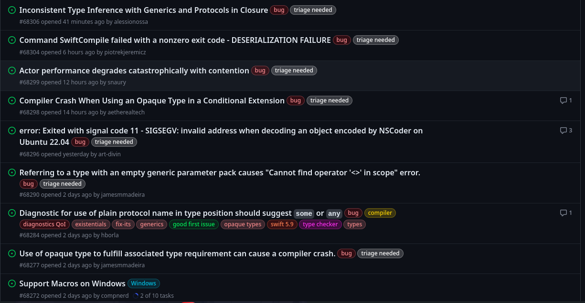

<p align="right">
    
    
</p>

# Las buenas prácticas de Git/Github

<p align="center">
    
</p>

> OJO. Nunca lo hagan xd. Puede llegar a generar conflictos o hacer valer un proyecto. xd

Las buenas prácticas son lo importante para su desarrollo en la indusdría y estas dependerán si tienen un buen desarrollo en su participación de proyectos y como los pueden organizar y en este markdown lo vamos a poner de la manera más ejemplificada.

## Commits

Un commit puede ser la diferencia entre que la otra persona entienda lo que hicieron o si hicieron su chamba, ya que tener un mal commit comentado no da información que pueda apoyar a los demás desarrolladores.

Por ejemplo **un mal commit** sería:

    git commit -am "asfjoijfpwivnowi"
    git push

Literalmente esa es la cara de su jefe de proyecto cuando ve algo así, y ni siquiera vieron que hicieron algo...

<p align="center">
    
</p>

Para evitar malos disgustos hay que saber usar el español o el inglés como ustedes perefieran pero lo importante  es usar los **verbos imperativos**. Recordando un poco de español son esos verbos (agregar, arreglar, cambiar, remover,etc.) En inglés es , added, fixed, removed, changed, etc.

SIEMPRE es mejor decir algo con simples palabras que con muchas. Ejemplo de un **commit pasable**:


    git commit -am "added a new remote branch"
    git push

Esto puede ir variando:

    git commit -am "fix a probled with the topbar"
    git commit -am "change the default system color"
    git commit -am "remove a random notification"
    git push


Otra reglita es **no usar puntos suspensivos en los mensajes**:

    git commit -m "Add new branch."
    git commit -m "Fix a problem with hola.sh script..."
    git push

Usa una descripción corta y precisa (no queremos aquí todo el relato de lo que hiciste en la mañana...)

Ejemplo de un **mal commit muy largo**:

    git commit -m "add Morbi rhoncus mauris at elit ornare fringilla. Donec mattis dolor ut est aliquam, iaculis ullamcorper est lacinia. Aenean suscipit odio ut neque auctor aliquam. Vestibulum viverra, sem in imperdiet egestas, justo tortor laoreet massa, aliquet faucibus nibh arcu laoreet augue. Mauris at lacus ante. Pellentesque habitant morbi tristique senectus et."
    git push

Ejemplo de un **commit conciso**:

    git commit -m "added a navbar on index.html"
    git push

Finalmente, cuandoun proyecto crece a que hacer unas modificaciones adicionales. Esto va depender de la nomenclatura que estén usando pero generlamente va de lo siguiente:

    git commit -m "[TIPO-DE-COMMIT][EQUIPO/DESARROLLADOR][RAMA] Descripción del commit"
    git push

Por ejemplo, supongamos que agregué una regla de seguridad a una aplicación y en este caso la compañia es PROTECO en el equipo de seguridad llamado Shibata y estos cambios lo hice en la **rama de desarrollo** llamada dev4.6 , además estoy reportando esto, entonces el ejemplo quedaría:

    git commit -m "[ADDED][SHIBATA][DEV4.6] Added security rule on wireless app"
    git push

## Issue y etiquetas
<p align="center">
    
</p>


Los issues son como la combinación o recomendaciones o desperfectos que la comunidad va haciendo a algunos de tus repositorios que ahí tienes un proyecto importante que andan opinando los programadores. Para guiarse un poco de cómo localizar cada cosa por ejemplo,una falla, una nueva recomendación sin hacer un PR, documentación, etc. Aquí dejo [las etiquetas usadas en Github](https://docs.github.com/es/issues/using-labels-and-milestones-to-track-work/managing-labels).

|Etiqueta|Descripción|
|:------:|:---------:|
|```bug```| Indica un problema inesperado o un comportamiento no deseado|
|```documentation```|Indica una necesidad de mejoras o adiciones a la documentación|
|```duplicate```|Indica incidencias, solicitudes de incorporación de cambios o debates similares|
|```enhancement```|Indica solicitudes de nueva función|
|```good first issue```|Indica una buena propuesta para los colaboradores por primera vez|
|```help wanted```|Indica que un mantenedor necesita ayuda en una propuesta o solicitud de extracción|
|```invalid```|Indica que una incidencia, una solicitud de incorporación de cambios o un debate ya no es importante|
|```question```|Indica que una incidencia, una solicitud de incorporación de cambios o un debate necesita más información|
|```wontfix```|	Indica que el trabajo no continuará en una incidencia, solicitud de incorporación de cambios o un debate|

Un ejemplo es el repositorio de [Swift de Apple](https://github.com/apple/swift).



