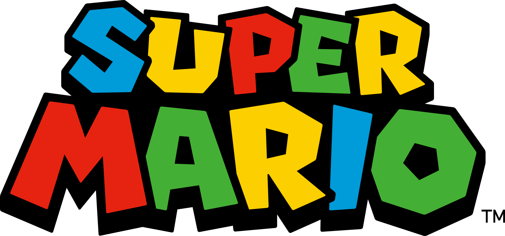
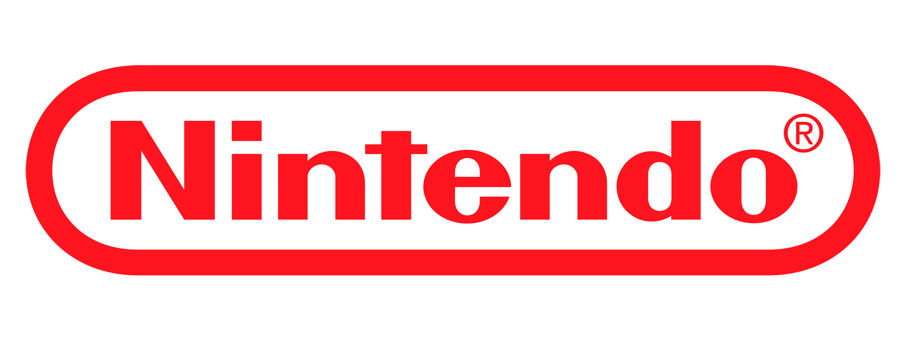
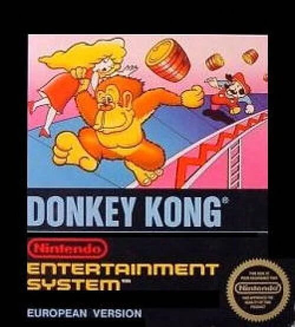
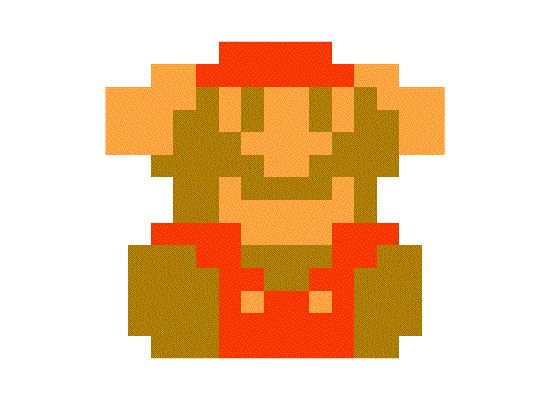
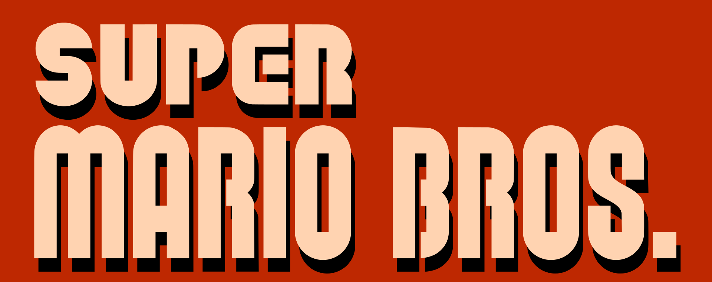
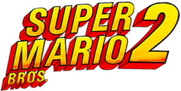
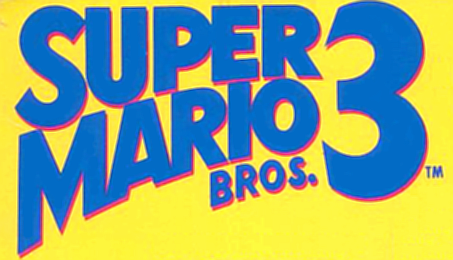
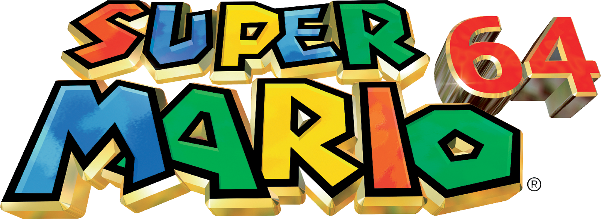
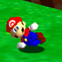
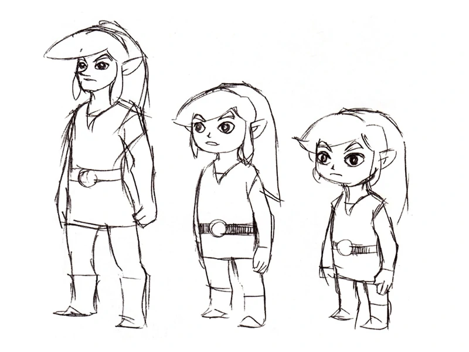

# Concepto y creación

 

 

## Creación

### Nintendo.

 
Nintendo, es la empresa desarrolladora del popular personaje de videojuegos **Mario**, sin embargo, todo empezó en el año 1889, cuando Fusajiro Yamauchi fundó una pequeña empresa llamada Nintendo Koppai para fabricar tarjetas de juego japonesas llamadas "hanafuda". El negocio fue sobre ruedas durante muchas décadas y la empresa siguió siendo uno de los principales productores de hanafuda del mundo.

Sin embargo, cuando Hiroshi, el nieto de Yamauchi, se hizo cargo del negocio en 1956, buscó formas de que la empresa pudiera diversificar sus fuentes de ingresos. Invirtió en muchas cosas que no siempre daban beneficios, como los "hoteles del amor", que atendían a parejas enamoradas, otra de paquetes de arroz y hasta una empresa de taxis.

Finalmente encontró un nuevo nicho en los años 60 y se hizo con el mercado de los juguetes electrónicos. Cuando vio el éxito de Atari, se propuso triunfar en el mercado de los videojuegos.

**En 1977, la empresa presentó la consola de videojuegos en color**

Venía precargada con diferentes versiones de un juego que, inicialmente, era la versión de Pong de la empresa. En los tres año siguientes, se vendieron más de 3 millones de unidades.

El joven Yamauchi quería más y se dedicó a los juegos de arcade de monedas. Nintendo produjo 3.000 cabinas Radar Scope para distribuirlas en Estados Unidos. Sin embargo, la suerte quiso que los vendedores de máquinas recreativas estadounidenses pensaran que el juego era demasiado parecido a Space Invaders.

Los pitidos y los ruidos no contribuyeron al poco atractivo general del juego. La empresa se quedó con un montón de máquinas en stock y parecía que sus sueños americanos se habían frustrado.

El revés inspiró a Yamauchi a volver a la mesa de dibujo y pidió al artista y desarrollador de productos Shigeru Miyamoto que creara un juego que atrajera a los americanos. Miyamoto se centró primero en la historia, e inspirándose en Popeye, presentó a un personaje llamado Jumpman que tenía que rescatar a su novia Pauline de un secuestrador gorila gigante llamado Donkey Kong.

### Primera aparición.

Donkey Kong (ドンキーコング, Donkī Kongu) es un videojuego arcade creado por Nintendo en el año 1981 la versión arcade. Es un videojuego del género plataformas que se enfoca en controlar al personaje sobre una serie de plataformas mientras evita obstáculos. La historia no es muy compleja, pero funciona para la época. El videojuego consiste en que Mario (llamado Jumpman en este videojuego ) debe rescatar a una dama que tiene capturada un enorme mono llamado Donkey Kong. Estos dos personajes se volvieron dos de los personajes de Nintendo más famosos.

Este videojuego fue el último esfuerzo de la compañía japonesa para penetrar con éxito en el mercado Norteamericano. Hiroshi Yamauchi, el entonces presidente de Nintendo, asignó el diseño de juego a **Shigeru Miyamoto**. Basándose éste en múltiples inspiraciones, incluyendo Popeye y King Kong, Miyamoto creó los escenarios y diseñó la jugabilidad, junto el jefe de sistemas de Nintendo, Gunpei Yokoi. Estos dos hombres crearon unos gráficos nuevos usando técnicas de caracterización, incluso escenas entre niveles para hacer avanzar la historia del juego, integrándola así en el mismo. 

### Algunos juegos populares posteriores.

#### Super Mario Bros

Super Mario Bros. (スーパーマリオブラザーズ Sūpā Mario Burazāzu?, lit. Superhermanos Mario) es un videojuego de plataformas, diseñado por Shigeru Miyamoto, lanzado el 13 de septiembre de 1985 y producido por la empresa japonesa Nintendo, para la consola Nintendo Entertainment System. El juego describe las aventuras de los hermanos Mario y Luigi, personajes que ya protagonizaron el arcade Mario Bros. de 1983. En esta ocasión ambos deben rescatar a la Princesa Peach del Reino Champiñón que fue secuestrada por el rey de los Koopas, Bowser. A través de ocho diferentes mundos, los jugadores pueden controlar a alguno de los dos hermanos y deben enfrentarse finalmente tras los niveles correspondientes de cada mundo a los monstruos de cada castillo para rescatar a la Princesa Peach.

Super Mario Bros. fue el juego que popularizó al personaje de Mario,4​ convirtiéndolo en el ícono principal de Nintendo, y uno de los personajes más reconocidos de los videojuegos, así como su hermano menor Luigi. Además, presentó por primera vez a la Princesa Peach Toadstool, Toad, Bowser, entre otros personajes. Este juego es considerado el primer videojuego de plataformas de desplazamiento lateral de Nintendo y se ha convertido en un hito debido a la trascendencia de su diseño y papel en la industria de los videojuegos

#### Super Mario Bros 2.

Super Mario Bros. 2, conocido en Japón como Super Mario USA (スーパーマリオUSA?), es un videojuego de plataformas desarrollado por Nintendo para la consola Nintendo Entertainment System. Fue lanzado originalmente en Estados Unidos en octubre de 1988, un año más tarde en Europa y en 1992 en Japón. 
SMB2 muestra a cuatro personajes (Mario, Luigi, Toad y Peach) a elegir para jugar, cada cual con sus propias habilidades. Este título posee un modo de juego totalmente diferente a su predecesora y a la secuela original de Super Mario Bros., conocida como Super Mario Bros.: The Lost Levels, pero lanzada en Japón como Super Mario Bros. 2.

Super Mario Bros. 2 es un videojuego de plataformas de desplazamiento lateral. Al comienzo de cada etapa, el jugador tiene una opción de entre cuatro personajes a elegir: Mario, Luigi, Toad, y la Princesa Peach (llamada simplemente "Princesa" en el juego). Cada personaje tiene diferentes habilidades, así Mario es un personaje promedio, pero Luigi puede saltar más alto que los demás. Toad puede correr y arrancar las hortalizas más rápido, y la Princesa puede saltar más lejos, debido a su capacidad de suspenderse en el aire por corto tiempo.1​ Todos los personajes tienen la habilidad de aumentar la altura de su salto al arrodillarse brevemente antes de saltar.

A diferencia de la mayoría de los juegos de la serie Mario, no hay enemigos en este juego que puedan ser derrotados al saltar sobre ellos. En cambio, el personaje debe lanzar algo contra el enemigo. Los personajes son capaces de arrancar las hortalizas de la tierra y aventarlas a los oponentes para derrotarlos. Otros enemigos a menudo pueden ser recogidos y arrojados también, y en varios niveles, hay bloques marcados con la palabra "POW", que cuando son recogidos y arrojados mata a todos los enemigos que se encuentren en la pantalla si en ese momento están en contacto con el suelo y no saltando, por ejemplo. 

#### Super Mario Bros 3.

Super Mario Bros. 3 (スーパーマリオブラザーズ３ Sūpā Mario Burazāzu Surī?, también conocido como Mario 3, Super Mario 3 y SMB3) es el tercer videojuego de plataformas de la franquicia Mario para la consola Nintendo Entertainment System (NES). Salió a la venta el 23 de octubre de 1988 en Japón y el 12 de febrero de 1990 en Estados Unidos. Al igual que en títulos anteriores, SMB3 fue diseñado por Shigeru Miyamoto, mientras que la banda sonora fue compuesta por Kōji Kondō. El juego retoma la historia del primer título, en la cual los fontaneros Mario y Luigi deberán salvar a la Princesa Peach de las garras de Bowser. 

El Reino Champiñón es atacado por el Rey de los Koopas. Esta vez, Bowser ha enviado a sus siete hijos, conocidos como Koopalings (コクッパ Ko Kuppa?, lit. "Niños Koopa"), para hacer lo que se les antoje en cada reino, robando los cetros (varitas mágicas) de los siete reyes que gobiernan en dicho mundo y convirtiéndolos en animales y plantas. Mario y Luigi son llamados nuevamente y en cada uno de estos mundos se infiltran en las naves de los Koopalings, derrotándolos y recuperando las varitas que custodian, para con ello devolver a la normalidad a los reyes y sus reinos Después de salvar el último reino, Mario y Luigi reciben una carta de Bowser diciéndoles que ha raptado a la princesa Peach, por lo que deberán derrotarlo para rescatarla.

#### Super Mario 64.

Super Mario 64 (スーパーマリオ64 Sūpā Mario Rokujūyon?) es un videojuego de plataformas de mundo abierto para la videoconsola Nintendo 64, desarrollado por Nintendo Entertainment Analysis and Development y publicado por Nintendo. Fue lanzado en Japón el 23 de junio de 1996, en América del Norte el 29 de septiembre de 1996 y en Europa el 1 de marzo de 1997. Junto con Pilotwings 64, fue uno de los títulos de lanzamiento para la consola. Como el juego principal del nuevo sistema de Nintendo, Super Mario 64 fortaleció las primeras ventas de la Nintendo 64 y ha vendido más de 11 millones de copias en todo el mundo, sin incluir las ventas de la Consola Virtual de Wii y Wii U ni su inclusión en el compilatorio Super Mario 3D All-Stars para Nintendo Switch.

Super Mario 64, el primer juego de plataformas en 3D de la saga de Super Mario, estableció un nuevo arquetipo para el género (gracias a su forma de juego, totalmente libre, y el formato de sus gráficos 3D poligonales mezclados con sprites bidimensionales) tal como Super Mario Bros. lo hizo para los juegos de plataformas en dos dimensiones. El juego ha sido llamado «revolucionario» y no solo ha influenciado a muchos grandes juegos en su género, sino que también ha tenido un duradero impacto en los juegos 3D en general.

Al cambiar de dos a tres dimensiones, Super Mario 64 reemplazó la tradicional pista de obstáculos de los juegos de plataformas por vastos mundos en los que el jugador debe completar múltiples y diversas misiones, con un énfasis en la exploración. Al hacer esto, logró preservar el «sentimiento» de los anteriores juegos de Mario al incluir muchos de sus elementos de juego y personajes. Es considerado por muchos críticos como uno de los mejores videojuegos de todos los tiempos.

##### Argumento

Super Mario 64 comienza con una carta de la Princesa Peach en la que invita a Mario a su castillo para comer un pastel que ella misma preparó para él. Cuando él llega, un Lakitu le dice a Mario que Bowser invadió el castillo y encerró a la Princesa y sus sirvientes dentro de él con el poder de 70 de las 120 estrellas de poder del castillo. Muchos de los cuadros del castillo son portales hacia otros mundos, en los que los secuaces de Bowser cuidan las estrellas. Mario debe buscar los portales y entrar a ellos para recuperarlas. A medida que va Mario encuentra más estrellas, él logra tener acceso a más partes del castillo, a través de llaves que obtiene de tres batallas con Bowser al conseguir al menos 8, 30 y 70 estrellas respectivamente. Tras vencer a Bowser por tercera vez, Peach es rescatada y el poder de las estrellas del castillo es recuperado. Peach recompensa a Mario con el pastel que le prometió

 <figcaption>
 Dance, Mario, dance! :D</figcaption>

## Diseño de personaje
El primer sprite de Link en The Legend of Zelda fue hecho por Takashi Tezuka, que tomó inspiración del personaje Peter Pan en su adaptación homónima hecha por Disney, de la cual se tomó el color verde para la ropa de Link para hacer que el personaje sea reconocible. Junto a su diseño caricaturesco, la apariencia de Link toma una aparente inspiración de los elfos o duendes, por el hecho de tener una muy baja estatura y sus orejas características. El cabello de Link fue castaño- negro en los primeros videojuegos de la saga, debido a las limitaciones de colores en la consola. A partir de a Link to the Past, su cabello fue representado como rubio fuerte y su color de ojos fue de color azul oscuro.

En el desarrollo de Ocarina of Time, Link tendría dos diseños de personaje: uno para su niñez, otro para su etapa adulta. Fue diseñado por Yusuke Nakano, (diseñador y artista de Ocarina of Time), quien tomó de referencia a "un actor bastante famoso de Hollywood" para el diseño y rostro de Link adulto en Ocarina of Time. Aunque Nakano no mencionó el nombre del actor, cuenta que en los 90's durante el desarrollo del juego, este actor era "muy famoso y reconocido por todos". Muchos fans asumen que se trata del actor Leonardo Dicaprio, debido al éxito mundial que fue su actuación en la película Titanic, estrenada un año antes que Ocarina of Time. Alternativamente, otros fans asumen que podría tratarse de actores populares de la época de los 1980's y 1990's como River Phoenix, Tom Cruise y Brad Pitt. Cerca de esos tiempos, Tom Cruise fue el protagonista de la película Legend en 1985, de la cual muchos fans consideran que Ocarina of Time tomó inspiración para su historia, incluyendo el evidente hecho que su papel protagónico lucía similar al diseño actual de Link. Por otro lado, además de la similitud física con el diseño del personaje de Link adulto, River Phoenix fue la inspiración para el diseño de otro personaje de videojuegos, Squall Leonhart de Final Fantasy VIII; lo que deja una pista del impacto que dejó su imagen y carrera para otros artistas/ ilustradores.

Durante la creación de Wind Waker, el diseño de Link tomó una apariencia mucho más caricaturesca al estar inspirada en la película "El Príncipe y el dragón de ocho cabezas" de 1963. Originalmente, existirían diferentes etapas de crecimiento físico para él, teniendo una apariencia de niño, adolescente y luego de adulto. Sin embargo, en el videojuego solo se presenta a su apariencia de niño.

<figure>

<figcaption>Concept Art de Link en Wind Waker</figcaption>
</figure>
 
 
Años después, en el desarrollo de Twilight Princess se tuvo la idea de diseñar a un Link adulto y maduro, sin embargo, esto fue descartado por su apariencia juvenil y adolescente. En el videojuego más reciente, Breath of the Wild, se diseñó a Link con una apariencia intencionalmente andrógina y de "género-neutro", para que tanto jugadores hombres y mujeres pudiesen identificarse más con el personaje. Eiji Aounuma ha declarado que desde Ocarina of Time, siempre quiso que Link fuese un "personaje género neutral", es decir, que su diseño y acciones como héroe se acoplen normalmente ambas audiencias femeninas y masculinas sin perder el sentimiento de inmersión en la jugabilidad. 
=======

