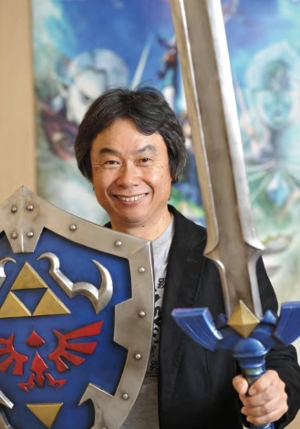

# Concepto y creación

La idea de Hideaki Anno antes de crear su magum opus era tener a una mujer fuerte y decidida como protagonista de la serie, por lo que desarrolló el personaje de Asuka, pero el diseñador de Evangelion, Yoshiyuki Sadamoto (con quien Anno había trabajado en Gunbuster y Nadia: El Secreto de la Piedra Azul, animes con protagonistas femeninos), imploró al sensei que le permitiese diseñar a un protagonista masculino. De esta manera fue que nació Shinji Ikari.

Para ponerle el nombre a su protagonista Hideaki Anno no se rompió mucho la cabeza, pues tomó prestado el de su compañero y amigo Shinji Higuchi, animador y director de películas que en ese entonces también trabajaba en Gainax. Para el apellido “Ikari”, Anno decidió tomar prestada una palabra de la terminología naval (tal como hizo con todos los pilotos de EVA): en esta caso, ikari al español se traduce como “ancla”.

La idea era mostrar a este adolescente como una persona vulnerable con algunos problemas de tipo emocional sin resolver, y conforme fuese avanzando la serie, llevarlo por el camino de su recuperación.

## Rol 
 
Link fue creado por Shigeru Miyamoto, inspirado por sus recuerdos de su infancia, incluyendo películas y libros que disfrutó en su juventud. Takashi Tezuka (diseñador de videojuegos) también siguió este patrón, notablemente tomando inspiración de la obra El Señor de los Anillos de J. R. R Tolkien, que fue una de sus obras favoritas.

Además de las limitaciones de la época, Link carece de diálogos o una caracterización de personaje completa, puesto que fue diseñado para que su esencia propia como personaje fuese ser un "vínculo" entre el jugador y el universo de Zelda. Con esta idea en mente, se eligió su nombre como "Link", que en inglés significa "enlace", "conexión" o "vínculo". En el videojuego, el jugador puede elegir el nombre de Link e insertar su propio nombre personal, u otro nombre que le guste, lo que añade más conexión entre el personaje como una extensión del jugador con el universo ficticio del videojuego. En otras declaraciones de Shigeru Miyamoto
<figure>

<figcaption>Shigeru Miyamoto</figcaption>
</figure>
 
 
y los diseñadores de Nintendo, se ha señalado varias veces que el foco de la saga se encuentra en las experiencias personales del jugador con el videojuego. De esta manera, Link habla para que el jugador humano lo pudiera llenar con sus propias características, experiencias, motivaciones, sentimientos, pensamientos y emociones, esto es con el fin de permitir al jugador entrar en este mundo de fantasía y tener una experiencia íntima con él, y con aquellos que viven en ella. Por lo tanto, la intención es que su papel en el diálogo y la trama estén en blanco, para que sea rellenado por las palabras y los pensamientos del jugador, hasta cierto punto. Su discurso suele ser reemplazado por una respuesta simple y concisa que el jugador puede elegir. Esta tradición se mantiene hasta la actualidad, aunque en distintas ocasiones Link muestra ciertos momentos de caracterización e incluso diálogos, demostrado en Twilight Princess, The Wind Waker o Skyward Sword. En estos juegos Link utiliza frases cortas, como "¡Vamos!" en ciertos puntos durante el juego.
 
 

## Diseño de personaje
El primer sprite de Link en The Legend of Zelda fue hecho por Takashi Tezuka, que tomó inspiración del personaje Peter Pan en su adaptación homónima hecha por Disney, de la cual se tomó el color verde para la ropa de Link para hacer que el personaje sea reconocible. Junto a su diseño caricaturesco, la apariencia de Link toma una aparente inspiración de los elfos o duendes, por el hecho de tener una muy baja estatura y sus orejas características. El cabello de Link fue castaño- negro en los primeros videojuegos de la saga, debido a las limitaciones de colores en la consola. A partir de a Link to the Past, su cabello fue representado como rubio fuerte y su color de ojos fue de color azul oscuro.

En el desarrollo de Ocarina of Time, Link tendría dos diseños de personaje: uno para su niñez, otro para su etapa adulta. Fue diseñado por Yusuke Nakano, (diseñador y artista de Ocarina of Time), quien tomó de referencia a "un actor bastante famoso de Hollywood" para el diseño y rostro de Link adulto en Ocarina of Time. Aunque Nakano no mencionó el nombre del actor, cuenta que en los 90's durante el desarrollo del juego, este actor era "muy famoso y reconocido por todos". Muchos fans asumen que se trata del actor Leonardo Dicaprio, debido al éxito mundial que fue su actuación en la película Titanic, estrenada un año antes que Ocarina of Time. Alternativamente, otros fans asumen que podría tratarse de actores populares de la época de los 1980's y 1990's como River Phoenix, Tom Cruise y Brad Pitt. Cerca de esos tiempos, Tom Cruise fue el protagonista de la película Legend en 1985, de la cual muchos fans consideran que Ocarina of Time tomó inspiración para su historia, incluyendo el evidente hecho que su papel protagónico lucía similar al diseño actual de Link. Por otro lado, además de la similitud física con el diseño del personaje de Link adulto, River Phoenix fue la inspiración para el diseño de otro personaje de videojuegos, Squall Leonhart de Final Fantasy VIII; lo que deja una pista del impacto que dejó su imagen y carrera para otros artistas/ ilustradores.

Durante la creación de Wind Waker, el diseño de Link tomó una apariencia mucho más caricaturesca al estar inspirada en la película "El Príncipe y el dragón de ocho cabezas" de 1963. Originalmente, existirían diferentes etapas de crecimiento físico para él, teniendo una apariencia de niño, adolescente y luego de adulto. Sin embargo, en el videojuego solo se presenta a su apariencia de niño.

<figure>

<figcaption>Concept Art de Link en Wind Waker</figcaption>
</figure>
 
 
Años después, en el desarrollo de Twilight Princess se tuvo la idea de diseñar a un Link adulto y maduro, sin embargo, esto fue descartado por su apariencia juvenil y adolescente. En el videojuego más reciente, Breath of the Wild, se diseñó a Link con una apariencia intencionalmente andrógina y de "género-neutro", para que tanto jugadores hombres y mujeres pudiesen identificarse más con el personaje. Eiji Aounuma ha declarado que desde Ocarina of Time, siempre quiso que Link fuese un "personaje género neutral", es decir, que su diseño y acciones como héroe se acoplen normalmente ambas audiencias femeninas y masculinas sin perder el sentimiento de inmersión en la jugabilidad. 
=======

