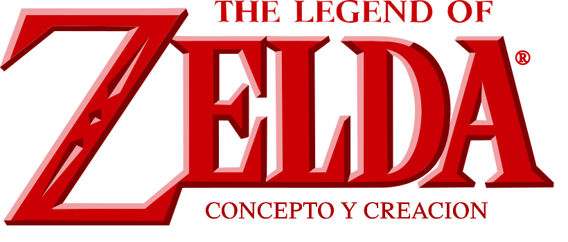

# Concepto y creación

  + Rol
 
Link fue creado por Shigeru Miyamoto, inspirado por sus recuerdos de su infancia, incluyendo películas y libros que disfrutó en su juventud. Takashi Tezuka (diseñador de videojuegos) también siguió este patrón, notablemente tomando inspiración de la obra El Señor de los Anillos de J. R. R Tolkien, que fue una de sus obras favoritas.

Además de las limitaciones de la época, Link carece de diálogos o una caracterización de personaje completa, puesto que fue diseñado para que su esencia propia como personaje fuese ser un "vínculo" entre el jugador y el universo de Zelda. Con esta idea en mente, se eligió su nombre como "Link", que en inglés significa "enlace", "conexión" o "vínculo". En el videojuego, el jugador puede elegir el nombre de Link e insertar su propio nombre personal, u otro nombre que le guste, lo que añade más conexión entre el personaje como una extensión del jugador con el universo ficticio del videojuego. En otras declaraciones de Shigeru Miyamoto y los diseñadores de Nintendo, se ha señalado varias veces que el foco de la saga se encuentra en las experiencias personales del jugador con el videojuego. De esta manera, Link habla para que el jugador humano lo pudiera llenar con sus propias características, experiencias, motivaciones, sentimientos, pensamientos y emociones, esto es con el fin de permitir al jugador entrar en este mundo de fantasía y tener una experiencia íntima con él, y con aquellos que viven en ella. Por lo tanto, la intención es que su papel en el diálogo y la trama estén en blanco, para que sea rellenado por las palabras y los pensamientos del jugador, hasta cierto punto. Su discurso suele ser reemplazado por una respuesta simple y concisa que el jugador puede elegir. Esta tradición se mantiene hasta la actualidad, aunque en distintas ocasiones Link muestra ciertos momentos de caracterización e incluso diálogos, demostrado en Twilight Princess, The Wind Waker o Skyward Sword. En estos juegos Link utiliza frases cortas, como "¡Vamos!" en ciertos puntos durante el juego.