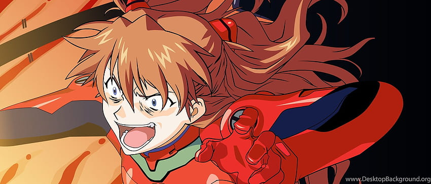

# Habilidades

Asuka es introducida por primera vez en el episodio 8,​ con la llegada de la unidad 02 y la batalla con Gaghiel, Asuka demuestra tener una alta sincronización y excepcionales habilidades como piloto de EVA, siendo muy agresiva y confiada en la batalla.

Su personalidad agresiva es una fachada que protege a una niña muy vulnerable e insegura, siendo esa una faceta que el espectador sólo ve en los sueños de la joven. Es importante resaltar que Asuka busca olvidar su pasado. Los fatídicos eventos de su niñez la marcaron, y por eso intenta olvidarlos. Sin embargo, sueña frecuentemente con dichos eventos.

Además, Link normalmente es presentado con una excelente condición física, realizando saltos mortales fácilmente, así como ser capaz de realizar sumo, como se ve en Twilight Princess. A pesar de esto, Link, por lo general se encuentra indefenso sin un arma o un objeto. Esto se ve en The Wind Waker, donde Link pierde su espada después de ser lanzado a la Isla del Diablo y debe utilizar sus habilidades sigilosas para moverse por la isla llena de enemigos. Aunque en algunos juegos, Link es fácilmente capaz de recoger piedras de gran tamaño o empujar bloques de su tamaño, en otros juegos se ve obligado a usar brazaletes especiales o guantes para aumentar aún más su fuerza.

Link es capaz de utilizar hechizos como el Fuego de Din, siempre que posea una barra de magia, que suele ser concedida por una Gran Hada. Link también tiene talento para tocar una amplia variedad de instrumentos, tales como la Ocarina del Tiempo. Estos objetos musicales sirven de gran ayuda a Link para superar los obstáculos de sus aventuras.

